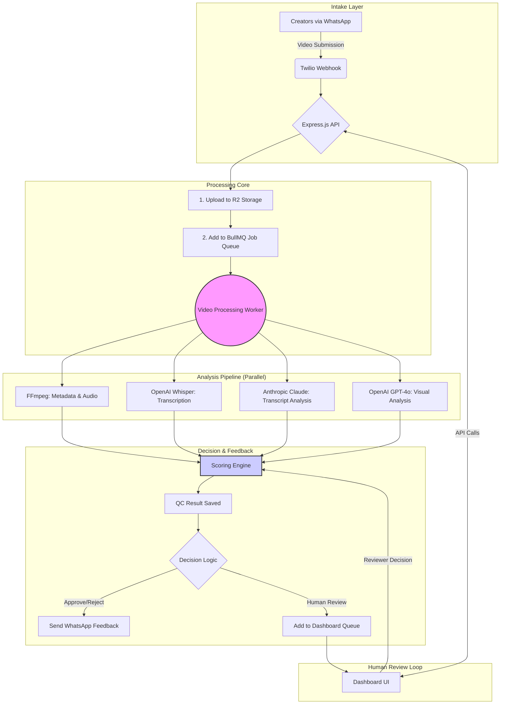

## ⚠️ Security Notice
- NEVER commit `.env` files to this repository
- `.env` files are listed in `.gitignore` and will be blocked by pre-commit hooks
- Always use `.env.example` as a template — it contains only placeholders
- If you accidentally expose a secret, rotate the key immediately
- Real API keys go ONLY in your local `.env` file, never in code

# CreatorQC: Automated Quality Control for Creator Videos

CreatorQC is a comprehensive, automated system designed to streamline the quality control process for videos submitted by creators for marketing campaigns. It ingests videos from sources like WhatsApp, runs them through a sophisticated AI-powered analysis pipeline, and provides a clear, actionable decision: **Approve**, **Reject**, or **Flag for Human Review**. This drastically reduces manual effort, shortens feedback cycles, and ensures consistent quality standards at scale.

The core of CreatorQC is its multi-faceted analysis pipeline. Videos are checked for technical specifications (format, resolution, duration), transcribed to analyze content for brand mentions and restricted keywords, and visually inspected frame-by-frame for clarity, branding, and safety. Audio quality is also assessed to ensure a professional final product. These analyses feed into a weighted scoring engine that calculates a final QC score and a "goodness" score, leading to an automated, data-driven decision.

For cases requiring a human touch, CreatorQC provides a clean, efficient dashboard for manual review. Campaign managers can view pending videos, see all AI-generated data and flags, watch the video, and make a final decision. The system then automatically notifies the creator with constructive feedback via WhatsApp. This closed-loop system not only saves significant time and money but also improves the creator experience by providing fast, clear, and consistent feedback.

## Architecture Diagram



## Local Setup

1.  **Clone the repository:**
    ```bash
    git clone https://github.com/fusebox440/project_Parivestra.git
    cd project_Parivestra/creatorqc
    ```

2.  **Configure Environment Variables:**
    Copy the example environment file and fill in your credentials.
    ```bash
    cp .env.example .env
    ```
    You will need API keys for Twilio, OpenAI, Anthropic, and Cloudflare R2, as well as SMTP credentials.

3.  **Start Services with Docker:**
    This command will build the images and start the backend, worker, frontend, Postgres, and Redis containers.
    ```bash
    docker-compose up --build
    ```

4.  **Seed the Database:**
    In a separate terminal, run the Prisma seed script to populate initial data (brands, campaigns, etc.).
    ```bash
    cd backend
    npx prisma db seed
    ```

5.  **Access the Application:**
    -   **Backend API**: `http://localhost:3000`
    -   **Frontend Dashboard**: `http://localhost:3001`

## Environment Variables

| Variable                      | Description                                                              | Required |
| ----------------------------- | ------------------------------------------------------------------------ | :------: |
| `DATABASE_URL`                | Connection string for the PostgreSQL database.                           |   Yes    |
| `REDIS_URL`                   | Connection string for the Redis server.                                  |   Yes    |
| `PORT`                        | Port for the backend Express server.                                     |    No    |
| `CORS_ORIGIN`                 | Allowed origin for CORS requests (e.g., your frontend URL).              |   Yes    |
| `TWILIO_ACCOUNT_SID`          | Your Twilio Account SID.                                                 |   Yes    |
| `TWILIO_AUTH_TOKEN`           | Your Twilio Auth Token.                                                  |   Yes    |
| `TWILIO_PHONE_NUMBER`         | Your Twilio WhatsApp-enabled phone number.                               |   Yes    |
| `OPENAI_API_KEY`              | API key for OpenAI (used for Whisper and GPT-4o).                        |   Yes    |
| `ANTHROPIC_API_KEY`           | API key for Anthropic (used for Claude).                                 |   Yes    |
| `CLOUDFLARE_ACCOUNT_ID`       | Your Cloudflare account ID.                                              |   Yes    |
| `CLOUDFLARE_R2_ACCESS_KEY_ID` | Access key for your Cloudflare R2 bucket.                                |   Yes    |
| `CLOUDFLARE_R2_SECRET_ACCESS_KEY` | Secret access key for your Cloudflare R2 bucket.                         |   Yes    |
| `CLOUDFLARE_R2_BUCKET_NAME`   | Name of your Cloudflare R2 bucket.                                       |   Yes    |
| `SMTP_HOST`                   | Hostname of your SMTP server for sending emails.                         |   Yes    |
| `SMTP_PORT`                   | Port for your SMTP server.                                               |   Yes    |
| `SMTP_USER`                   | Username for SMTP authentication.                                        |   Yes    |
| `SMTP_PASS`                   | Password for SMTP authentication.                                        |   Yes    |
| `CAMPAIGN_MANAGER_EMAIL`      | Email address to send "human review required" notifications to.          |   Yes    |
| `DASHBOARD_URL`               | Base URL of the frontend dashboard for links in emails.                  |   Yes    |
| `NEXT_PUBLIC_API_URL`         | Base URL for the backend API, used by the frontend.                      |   Yes    |

## API Endpoints

| Method | Path                               | Description                                                  |
| :----- | :--------------------------------- | :----------------------------------------------------------- |
| `POST` | `/webhook/twilio`                  | Ingests video submissions from Twilio WhatsApp messages.     |
| `POST` | `/upload`                          | Allows direct video uploads via a multipart/form-data request. |
| `GET`  | `/health`                          | Health check endpoint for the backend service.               |
| `GET`  | `/api/dashboard/stats`             | Retrieves real-time statistics for the dashboard overview.   |
| `GET`  | `/api/dashboard/queue`             | Fetches the list of videos pending human review.             |
| `PATCH`| `/api/dashboard/queue/:id/resolve` | Approves or rejects a video from the human review queue.     |
| `GET`  | `/api/dashboard/campaigns/:id/report` | Gets a summary report for a specific campaign.             |
| `GET`  | `/api/dashboard/submissions/:id`   | Retrieves detailed information for a single video submission.|

## Scoring System

The decision engine uses two primary scores:

1.  **QC Score (Quality Control)**: A weighted average of technical and content-related metrics. A low score indicates objective problems.
    -   **Weights**: Format (25%), Transcript (30%), Visuals (30%), Audio (15%).
2.  **Goodness Score**: A measure of the video's creative quality and potential effectiveness, derived from AI analysis.
    -   **Weights**: Engagement (40%), Clarity (30%), Brand-Alignment (30%).

**Decision Thresholds**:
-   **REJECTED**: Any "hard-fail" flag is present OR QC Score < 40.
-   **HUMAN_REVIEW**: 40 <= QC Score < 70.
-   **APPROVED**: QC Score >= 70 AND Goodness Score >= 60.

## Cost Analysis

A detailed cost breakdown and ROI analysis is available in [COST_ANALYSIS.md](COST_ANALYSIS.md). The system is projected to reduce manual review costs by over **70%** at an 85% automation rate.

## Architecture Decisions & Tradeoffs

-   **BullMQ & Redis**: Chosen for a robust, persistent job queue to handle asynchronous video processing. This ensures no video is lost even if a worker instance fails and allows for easy scalability of the processing workforce.
-   **Multi-stage Docker Builds**: Used to create lean, optimized production images by separating build-time dependencies from runtime necessities.
-   **Cloudflare R2**: Selected as a low-cost, S3-compatible object storage solution, avoiding vendor lock-in with AWS S3 while offering zero egress fees.
-   **Multiple AI Models**: Instead of relying on a single provider, we leverage the best tool for each job (Whisper for transcription, GPT-4o for vision, Claude for text analysis) to maximize quality and cost-effectiveness.
-   **Prisma ORM**: Provides type safety and simplifies database interactions, speeding up development and reducing the likelihood of SQL injection vulnerabilities.
-   **Next.js with Standalone Output**: The frontend is built to a standalone server, which is ideal for Dockerization and efficient deployment, minimizing the container's footprint.
